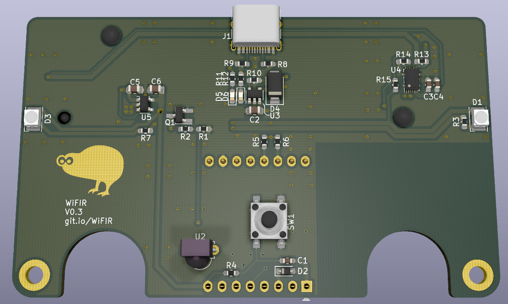

# Duckles generic PCB template

This is the WiFIR. It's basically a battery operated wifi IR-blaster. It's intended to remote-control a heat-pump to heat up a house in advance. More details later :)

[Interactive BOM](duckle29.github.io/WiFIR/hardware/pcb/ibom.html)
